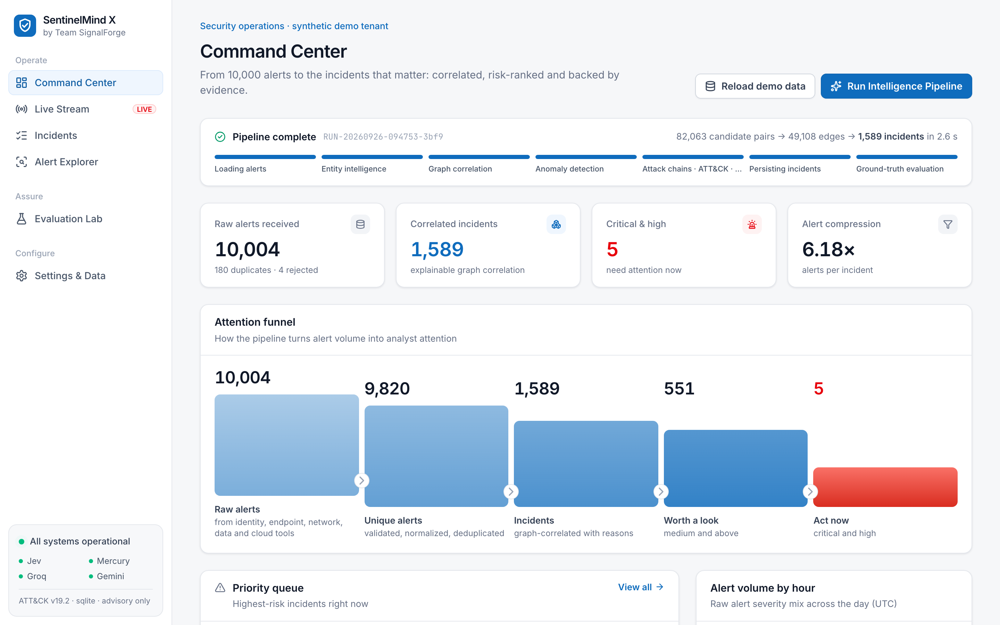
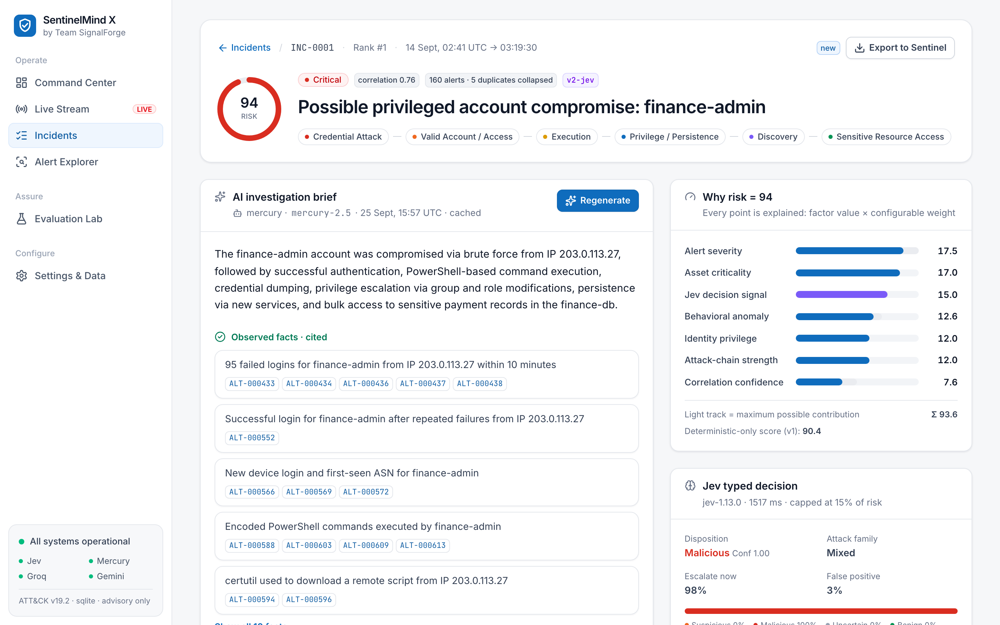
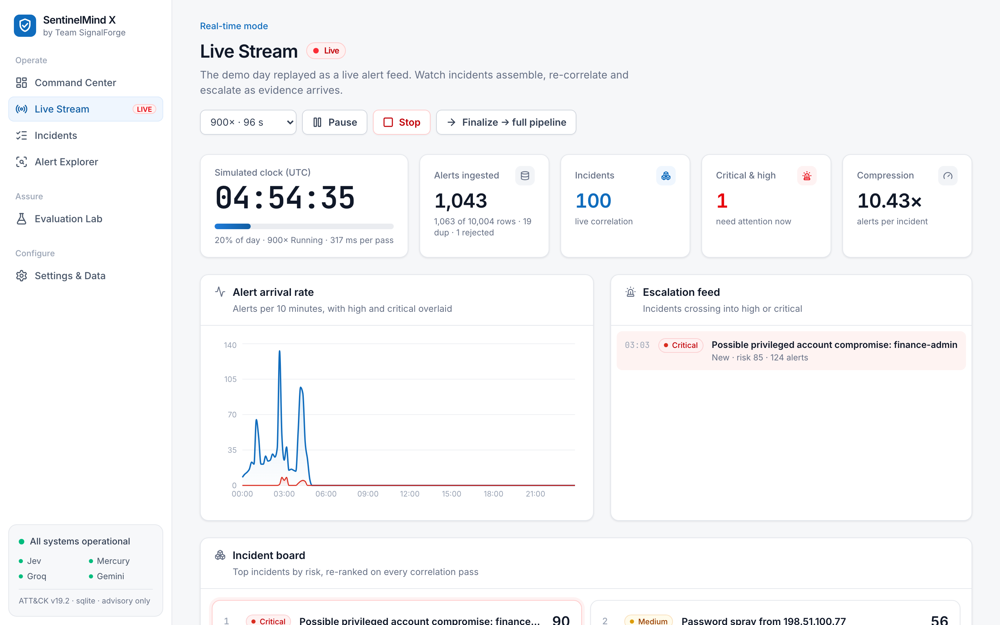

# SentinelMind X

**AI security incident intelligence — Team SignalForge · Microsoft Innovate 2026, Problem #25 "3,000 Alerts, One Analyst".**

SentinelMind X turns thousands of disconnected security alerts into a short, risk-ranked queue of
evidence-backed incidents. Each incident comes with an attack timeline, an entity graph, ATT&CK context,
an explainable risk score and a grounded investigation brief.

> From 10,000 alerts to the 3 incidents that matter.

The core product works with **no cloud service and no LLM**. Correlation, anomaly scoring, attack chains,
ATT&CK mapping, risk and the template brief are all local and deterministic. AI providers are optional
layers on top:

- **Jev** (TypeSafe): typed triage decisions, one request per incident, capped at 15% of risk.
- **Mercury 2.5 → Groq gpt-oss-120b → Gemini → Groq gpt-oss-20b → template**: narrative brief with automatic failover and a per-provider circuit breaker.
- **Microsoft Foundry**: optional provider.



| Incident detail | Live stream |
| --- | --- |
|  |  |

## Quick start (local, no Docker)

Requirements: Python 3.12 with [uv](https://docs.astral.sh/uv/), and Node 20+.

```bash
make setup      # uv sync + npm install
make backend    # API on http://localhost:8000  (SQLite at data/sentinelmind.db, migrations run on start)
make frontend   # UI  on http://localhost:3000  (proxies /api to :8000)
```

Open http://localhost:3000, click **Load Demo**, then **Run Intelligence Pipeline**. Loading takes about 2 s and the pipeline about 3 s.

Headless alternative: `make demo` with the backend running, or `cd backend && uv run python ../scripts/seed_db.py`.

## Full stack (Docker Compose + Postgres/pgvector)

```bash
cp .env.example .env     # optional: add provider keys
docker compose up --build
```

Services: `db` (PostgreSQL 16 + pgvector) :5432 · `backend` :8000 · `frontend` :3000 (production build).
Verified end to end with the Playwright golden path on this stack.

## Live Stream mode

**Live Stream** in the sidebar replays the demo day as a live alert feed at 300–1800× speed. Alerts go through normal
ingestion as they "arrive". The deterministic pipeline (correlation, anomaly, ATT&CK, risk) re-runs on everything
received so far every ~1.5 s, so the audience watches incidents assemble and escalate:
- ~02:45 simulated time: "Repeated failed authentication: finance-admin" appears as high.
- ~02:57: it escalates to critical as "Possible privileged account compromise" once execution follows the sign-in.
- The spray and the DC exfiltration surface later in the day.

The stream makes no external AI calls. **Finalize** persists the day and runs the full pipeline (Jev, briefs,
evaluation). The end state matches the batch pipeline exactly (tested).

## Microsoft Sentinel connector

- **Import:** upload a Sentinel `SecurityAlert` export as a KQL JSON/CSV result or a Log Analytics query API response
  (Settings → Import alerts, or `POST /api/v1/alerts/upload`). Rows are detected and mapped automatically:
  - entities (account, host, ip, process → file, mailbox, cloud-application) become canonical fields;
  - `AlertName` is classified to the alert-type catalog;
  - `Techniques` are kept as vendor-reported ATT&CK evidence and named from the local catalog;
  - the raw row is preserved for audit.
- **Round-trip proof:** Settings → *Ingest through the Microsoft Sentinel connector* renders the 10k corpus as
  SecurityAlert rows first. Correlation stays at P 0.998 / R 0.994 and the golden story stays #1.
- **Export:** *Export to Sentinel* on any incident, or `GET /api/v1/incidents/{id}/sentinel`, downloads a payload shaped
  for the Sentinel incidents API. It includes title, severity, status, classification from the analyst verdict,
  tactics, techniques, related alert IDs, entities and a comment with the evidence-cited brief. SentinelMind never
  pushes to Sentinel itself; the export is advisory.

## Demo insurance: AI cache + offline mode

`make prewarm` computes Jev decisions and model briefs for the top incidents and saves them to `data/ai_cache.json`
(committed; synthetic data only). Loading the demo imports this cache automatically. Cache keys are evidence hashes,
so the output reattaches to the same incidents. With `OFFLINE_MODE=true` (`make offline`, or
`OFFLINE_MODE=true docker compose up`) the app makes **zero outbound AI calls**, yet still shows the Jev-weighted
ranking and the model-written briefs. The UI shows an "Offline demo mode" badge.

## Commands

| Task | Command |
| --- | --- |
| Tests (54 backend + TS type-check; E2E: `cd frontend && npm run e2e`) | `make test` |
| Cache AI output for the demo / run with no AI network calls | `make prewarm` / `make offline` |
| Regenerate UI screenshots (servers running) | `cd frontend && node scripts/screenshots.mjs` |
| Regenerate demo corpus (seed) | `make seed SEED=11` |
| Multi-seed robustness benchmark | `make benchmark` |
| Refresh ATT&CK catalog from official STIX | `make mitre` |
| Export briefs for manual claim rating | `cd backend && uv run python ../scripts/evaluate_summaries.py` |
| Reset environment | `POST /api/v1/demo/reset` or Settings page |
| API docs | http://localhost:8000/docs |

## What happens in the pipeline

```
alerts.jsonl ─► ingestion (validate · UTC · canonical identities · dedupe · row-level rejects)
            ─► entity intelligence (inverse-frequency + temporal-spread rarity, CMDB/identity context)
            ─► graph correlation (indexed candidates in 30-min window · weighted edges · components
                                  · anti-megacluster splitting · "why grouped" for every membership)
            ─► anomaly (robust z-score rules + Isolation Forest on behavioral features)
            ─► attack chain (deterministic ordered stages) ─► ATT&CK (rules over official STIX catalog)
            ─► explainable risk (factor decomposition; v2 adds a capped Jev signal)
            ─► ranked incidents ─► evidence pack ─► brief (Mercury → Groq 120b → Gemini → Groq 20b → template, citation-validated)
```

## Measured results (synthetic ground truth; computed, not hard-coded)

Output of `make benchmark` for seeds 7, 11, 23 and 42 (9,820 unique alerts each):

| Metric | Range across seeds |
| --- | --- |
| Pairwise correlation precision | 0.989 – 0.998 |
| Pairwise correlation recall | 0.990 – 0.999 |
| Incident purity | 0.993 – 0.995 |
| Top-3 critical recall | 1.00 |
| Top-5 high/critical recall | 0.80 (impossible-travel story ranks #6) |
| False-high rate on benign incidents | 0.0000 – 0.0006 |
| Alert anomaly F1, rules only → rules + Isolation Forest | 0.686 → 0.79–0.80 |
| Pipeline runtime (laptop) | 1.3 – 1.6 s (+ ~3 s for 25 Jev decisions) |

With Jev enabled (seed 7, `jev-1.13.0`, 25 top incidents, median 1.05 s per decision): top-5 high/critical recall
rises from **0.80 to 1.00**. All five planted attacks rank #1–#5 as high/critical. The benign maintenance incident drops
to #6 as medium. False-high rate stays 0. Jev rated all five attacks `malicious` (confidence 1.00) and the maintenance
`benign` with low confidence, which triggers a human-review flag.

**Narrative provider routing (measured 2026-09-25).** The order is `Inception mercury-2.5 (instant) → groq
gpt-oss-120b → gemini-3.8-flash (→ 3.1-flash-lite) → groq gpt-oss-20b → template`.
- **mercury-2.5** (diffusion LLM): 10/10 briefs schema- and citation-valid, median 3.2 s, max 4.8 s. It takes the
  full evidence pack (260K context). Free-tier limits are 1M input tokens per minute. It costs about $0.0006 per brief.
- **gpt-oss-120b**: valid briefs in 3–4 s, but Groq's free plan allows 8K tokens per minute, so the pack is trimmed
  and the third back-to-back brief hits a 429.
- **gemini-3.8-flash**: returned `503 high demand` all through testing. 3.1-flash-lite worked in 14–22 s.
- **gpt-oss-20b**: often fails Groq's strict-schema check.

A provider that returns 429, 503 or a timeout is skipped for 60 s (circuit breaker). Change the order with
`NARRATIVE_PROVIDER_ORDER`.

The Evaluation Lab page recomputes these numbers after every run. The triage-time experiment is recorded
live in the UI and reported as a median. No triage-time claim is made until those trials exist.

## Repository

```
backend/app/services   ingestion, normalization, entities, correlation, anomaly, attack_chain, mitre,
                       risk, pipeline, agent, evaluation, demo_data, knowledge, runner
backend/app/llm        provider interfaces + Jev, Gemini, Groq, Foundry adapters (raw HTTPS, no vendor SDKs)
backend/app/api        FastAPI routes + incident graph builder
backend/alembic        migrations
frontend/src           React + TS + Vite + Tailwind + TanStack Query + Recharts + Cytoscape
scripts/               generate_demo_data, seed_db, download_mitre, benchmark_pipeline, evaluate_summaries
data/mitre             attack_catalog.json (ATT&CK v19.2 snapshot built from the official STIX 2.1 bundle)
docs/                  architecture, demo script, evaluation, threat model
```

## Safety boundaries

The system is advisory only. It never disables accounts, blocks IPs, runs remediation or takes offensive
action. The investigation agent has read-only tools. Alert text is untrusted data: an embedded
prompt-injection string in the golden incident is detected, flagged and shown as data. The free Gemini
tier may use submitted data, so send it only the synthetic demo data. See `docs/threat-model.md`.
